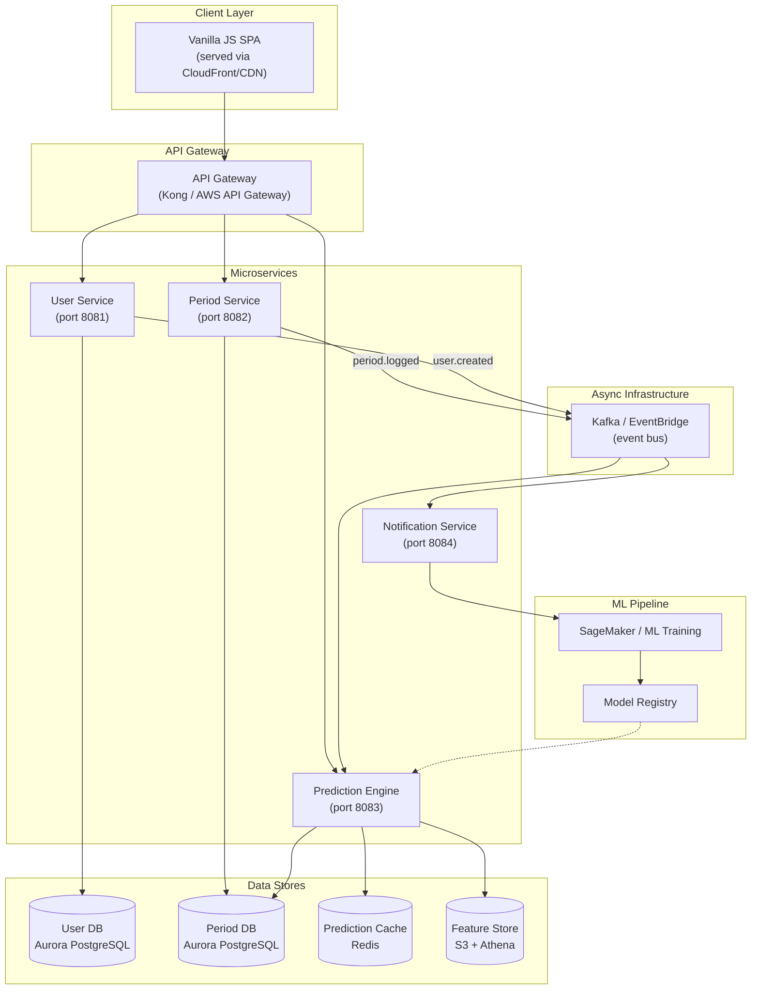
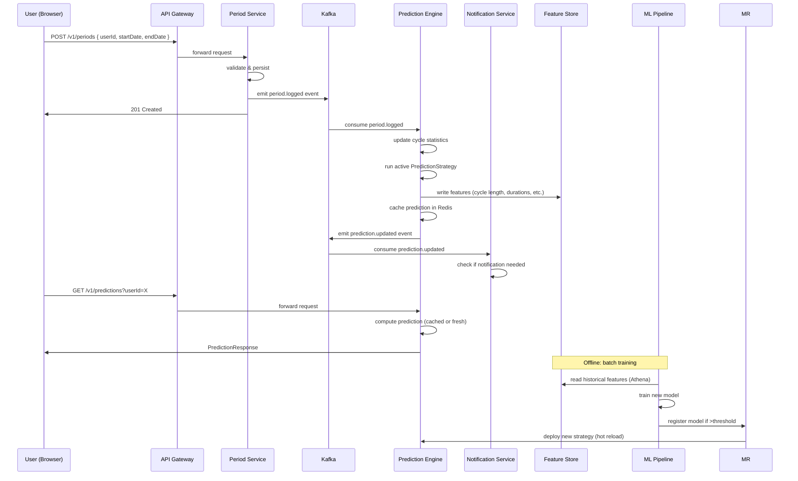
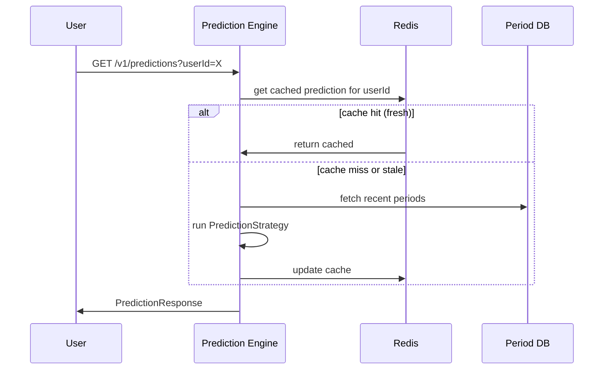
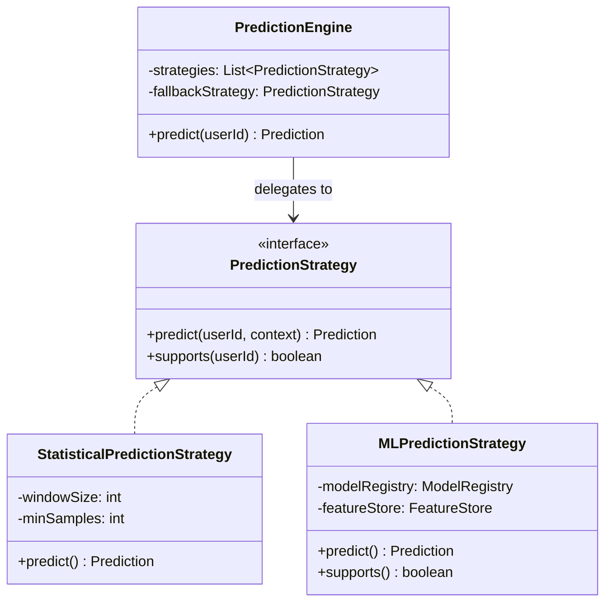
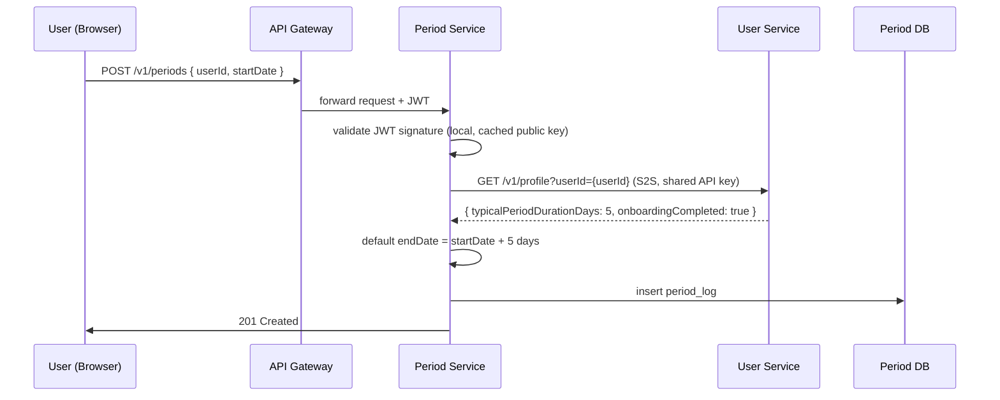
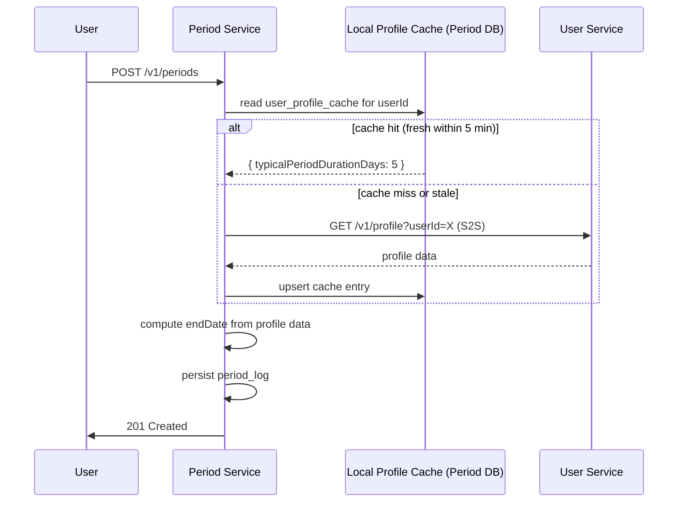
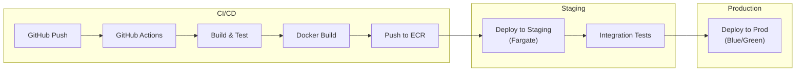

# maas — Production Architecture

## Overview

maas (Menstrual health as a Service) is designed as a **microservice architecture** from day one, with each service owning its own data store and communicating via asynchronous events where possible. The prediction engine uses a **strategy pattern** to allow swapping from a simple statistical baseline to ML-based models without changing the caller.

## Architecture Diagram



## Data Flow Diagram



### Alternative: Read-Through Cache on Read Path

For lower prediction latency, the read path can fetch from the cache (Redis) and only compute fresh if the cache is cold:



## Component Details

### 1. User Service (Port 8081)
- **Responsibilities:** Registration, profile management, authentication (JWT or OAuth2)
- **Database:** Aurora PostgreSQL
  - `users` — user identities
  - `user_profiles` — onboarding/health profile data
  - **This is the source of truth for user existence** — every other service looks here (via S2S call) to validate a user before processing data.
- **Endpoints:**
  - `GET /v1/users` — list/search users
  - `GET /v1/users/{id}` — get user by ID (used by other services for user existence checks)
  - `PUT /v1/profile` — create/update profile
  - `GET /v1/profile` — get profile
- **Events emitted:** `user.created`, `profile.updated`

### 2. Period Service (Port 8082)
- **Responsibilities:** CRUD for period logs, cycle statistics computation, idempotent writes
- **Database:** Aurora PostgreSQL
  - `period_logs` — logged menstrual periods
  - `symptom_catalog`, `symptom_entries` — symptom reference and per-log entries
  - `user_cycle_stats` — computed aggregate statistics (cached locally per user)
  - **Does NOT store users.** User existence verified via S2S call to User Service.
- **Indexing:** Composite index on `(user_id, start_date)` — all queries are per-user and order by date, so a single B-tree index handles reads efficiently without partitioning.
- **Natural key:** `(user_id, start_date)` ensures idempotent period logging
- **Endpoints:**
  - `POST /v1/periods` — log a period (idempotent via unique constraint)
  - `GET /v1/periods` — list periods (paginated)
- **Events emitted:** `period.logged`, `period.updated`, `period.deleted`

### 3. Prediction Engine (Port 8083)
- **Responsibilities:** Cycle prediction, ovulation estimation, fertile window calculation
- **Strategy pattern** for extensible prediction algorithms:
  - `PredictionStrategy` — interface
  - `StatisticalPredictionStrategy` — rolling average + std deviation (current default)
  - `MLPredictionStrategy` — loads model from registry (future)
- **Cache:** Redis — predictions cached per user, invalidated on new period log
- **Feature Store:** S3 + Athena for batch feature extraction (cycle lengths, durations, flow patterns, symptoms)
- **Endpoints:**
  - `GET /v1/predictions` — get prediction for user
  - `GET /v1/predictions/health` — strategy health / fallback status
- **Consumes events:** `period.logged`, `user.created`
- **Emits events:** `prediction.updated`

### 4. Notification Service (Port 8084)
- **Responsibilities:** Send push/email/SMS reminders
- **Database:** Aurora PostgreSQL — `notification_prefs`, `notification_log` tables
- **Consumes events:** `prediction.updated` (triggers upcoming period reminder)
- **Future:** Scheduled checks via cron job for users approaching predicted dates

## Prediction Strategy — Extensibility



The `PredictionEngine` maintains an ordered list of strategies. It tries each strategy's `supports()` method and uses the first that returns true. If all fail, it falls back to the onboarding baseline. This allows:
1. **Progressive enhancement** — users with few logs get statistical predictions; users with rich history get ML predictions
2. **A/B testing** — different strategies can be assigned to different user cohorts
3. **Graceful degradation** — if the ML service is down, falls back to statistics

## Data Model (Per-Service Databases)

Each microservice owns its own database schema — no service directly reads another service's tables. Cross-service data access happens only through the owning service's API or through shared events on the event bus.

### User Service Database
```
users                          # User Service OWNER
├── id, email, display_name, created_at, updated_at
└── user_profiles
    └── id, user_id (FK), typical_cycle_length_days, typical_period_duration_days,
        last_period_start_date, onboarding_completed, created_at, updated_at
```

### Period Service Database
```
period_logs                    # Period Service OWNER
├── id, user_id, start_date, end_date, flow_intensity, notes,
│   cycle_length_days, created_at, updated_at
│   UNIQUE(user_id, start_date)
├── symptom_catalog
│   └── id, name, category, icon
├── symptom_entries
│   └── id, period_log_id (FK), symptom_id (FK), severity
└── user_cycle_stats
    └── id, user_id (FK, unique), total_cycles_logged, avg_cycle_length_days,
        avg_period_duration_days, last_updated
```

### Notification Service Database
```
notification_prefs             # Notification Service OWNER
├── id, user_id, push_enabled, email_enabled, remind_days_before
└── notification_log
    └── id, user_id, type, sent_at, status
```

### Prediction Engine (Cache Only — Redis)
```
prediction:{userId}            # Redis key — Prediction Engine OWNER
└── value: JSON blob (next period dates, confidence, etc.)
```

## Inter-Service Communication

### What Data Does Each Service Need from Others?

Before choosing a communication pattern, we must identify every cross-service data dependency:

| Consumer Service | Data Needed | Owner Service | When Needed |
|---|---|---|---|
| Period Service | User existence + `typical_period_duration_days` | User Service | On every `POST /v1/periods` (to default `endDate` from profile) |
| Prediction Engine | Period logs for a user | Period Service | On every `GET /v1/predictions` (cache-miss path) |
| Prediction Engine | User existence | User Service | On every prediction request |
| Notification Service | Prediction results | Prediction Engine | On `prediction.updated` events |
| Notification Service | User push token, email | User Service | Before sending a notification |

The Prediction Engine's need for period logs is already solved via direct database reads (`PRED --> PS_DB` in the architecture diagram — a read-replica follower, not a cross-service S2S). The remaining three are where we need explicit patterns.

### Approach Comparison: How Should the Period Service Get Profile Data?

The Period Service needs `typical_period_duration_days` from the user's profile on every `POST /v1/periods` (to default the end date when the client omits it). It also needs to verify the user exists. These could be one call or two. Here are the viable approaches:

#### Option A: JWT-only (not sufficient alone)

**How it works:** The API Gateway validates the JWT. The Period Service also validates the JWT signature locally using the User Service's public key (obtained at startup and cached). The `sub` claim contains `userId`. If the JWT is valid, the user authenticated — they existed at token-issue time.

**Why it's not enough:** JWTs authenticate; they don't carry profile data. The Period Service needs `typical_period_duration_days` to default the end date. You could embed it as a custom JWT claim:

```json
{
  "sub": "42",
  "iat": 1720000000,
  "exp": 1720003600,
  "typicalPeriodDurationDays": 5
}
```

But this introduces a staleness problem — if the user updates their period duration in User Service, the old value lives in the JWT until the token expires.

**Verdict:** Useful for *existence verification* on the read path, but doesn't solve the profile data need for writes.

#### Option B: Full S2S Call (chosen for write path)

**How it works:** On `POST /v1/periods`, the Period Service calls User Service's `GET /v1/profile?userId=X` — a single S2S round trip that returns both existence confirmation and the profile fields needed (`typical_period_duration_days`, `onboarding_completed`).



Note the two-step validation: JWT proves the request is authenticated (local, ~0ms), then the S2S call fetches fresh profile data (single round trip, ~5-15ms). The JWT covers existence verification — if the token is valid, the user existed at issue time. The S2S gets the profile data we actually need.

#### Option C: Event Replication

**How it works:** User Service emits `profile.updated` events on Kafka. Period Service consumes them and maintains a local `user_profile_cache` table with just the fields it needs.

```
user_profile_cache             # Period Service, populated via events
└── user_id (PK), typical_period_duration_days, onboarding_completed,
    last_updated (from event timestamp)
```

On `POST /v1/periods`, the Period Service reads from this local table — no S2S call. User existence is verified via the JWT (same as Option B).

**Trade-offs:**

| Consideration | Option B — S2S | Option C — Event Replication |
|---|---|---|
| Profile freshness | Always current (read from source of truth) | Stale until event processes (~100ms-2s lag in steady state) |
| Write-path latency | +5-15ms (network round trip) | +0ms (local query) |
| User Service dependency | Hard — outage blocks period logging | Soft — stale cache is usable during outage |
| Complexity | Low — one HTTP call | Medium — consumer, DLQ, shadow table schema, replay |
| Cold start | None | First request for a new user misses cache (requires fallback S2S or wait for event) |
| Consistency model | Strong | Eventual |

#### Option D: Hybrid S2S + Local Cache (recommended for production)

The pragmatic production choice: blend B and C. On the write path, prefer the local cache. If the cache is cold or stale beyond a threshold (e.g., >5 minutes), fall back to an S2S call and refresh the cache inline.



This gives you:
- **P50 latency mostly 0ms** (cache hit)
- **P99 latency = S2S latency** (cache miss — rare after warmup)
- **Resilience:** User Service can go down for minutes; the stale cache still serves correctly
- **Freshness guarantee:** at most 5 minutes stale (configurable)

### Implementation Challenges

#### 1. Shared Secret / Public Key Distribution

For JWT validation, every service needs the User Service's signing public key. Options:

- **Static config:** embed the public key in each service's env config. Simple but key rotation requires a coordinated deploy.
- **JWKS endpoint:** User Service exposes `GET /v1/auth/jwks.json`. Other services fetch it on startup and cache (with periodic refresh). Supports key rotation — new key published, old key kept until all in-flight tokens expire.
- **Recommended:** JWKS endpoint with a 1-hour cache refresh. Key rotation publishes a new key entry; services pick it up within the cache TTL.

**Challenge at scale:** If every service polls JWKS on a timer, 100 service instances all hitting `GET /v1/auth/jwks.json` simultaneously at the top of the hour creates a thundering herd. Mitigate with jitter (+/- 30% of refresh interval) or serve JWKS from a CDN/Redis cache.

#### 2. Token Refresh and Stale Claims

JWT access tokens must be short-lived (15-60 minutes) so that revoked users don't retain access. This means the client needs a refresh token flow:

```
Access Token (15 min)  ──expires──>  401 ──> refresh with refresh token ──> new access token
```

**Challenge:** If a user updates their `typical_period_duration_days` and immediately logs a period, the JWT still carries the old value. With Option D (hybrid), this isn't an issue because the S2S fallback or event replication provides fresh data. But if someone tries pure JWT claims, this is a real problem.

#### 3. Cascading Failure / Circuit Breaking

With S2S calls on the write path, a User Service slowdown or outage propagates to the Period Service. Mitigations:

- **Client-side timeout:** S2S call times out at 2s (not the default 30s). Fail fast, don't queue up threads.
- **Circuit breaker:** If User Service returns 5xx or times out 5 times in 30s, open the circuit for 15s. During open-circuit, degrade: use the cached profile value (Option D) or skip the defaulting and require the client to always provide `endDate` (safe degradation).
- **Bulkhead isolation:** Thread pool for User Service calls is capped at 10 threads. If exceeded, requests fail immediately rather than queuing and exhausting the container.

```java
// Rough sketch: circuit breaker + fallback
public Profile getProfile(long userId) {
    if (circuitBreaker.isOpen()) {
        return profileCache.get(userId)  // stale but usable
            .orElse(DEFAULT_PROFILE);
    }
    try {
        Profile p = userServiceClient.getProfile(userId, Duration.ofSeconds(2));
        profileCache.put(userId, p);
        circuitBreaker.recordSuccess();
        return p;
    } catch (Exception e) {
        circuitBreaker.recordFailure();
        return profileCache.get(userId)
            .orElseThrow(() -> new ServiceUnavailable("User Service unavailable"));
    }
}
```

#### 4. Profile Defaulting When Data Is Unavailable

The Period Service's default for `endDate` is `startDate + typicalPeriodDurationDays`. If neither the cache nor the S2S call can provide this value, the service has three options:

1. **Require client to send `endDate`** — shift the burden to the API contract. Simplest, but breaks backward compatibility.
2. **Use a global default** (e.g., 5 days) — works for most users but is wrong for outliers. Safe as a last resort, acceptable accuracy for a default.
3. **Reject the request** — safest, but poor UX. Only appropriate if the circuit breaker is truly exhausted and other services are degraded too.

The current code already has a fallback: `orElse(request.startDate())` at line 64 of `PeriodService.java` — it defaults to a zero-day period. This is intentionally conservative (better to undercount than overcount health data).

### Scaling Considerations

#### As the User Base Grows

| Scale | Users | Period Logs/min | Challenge |
|-------|-------|-----------------|-----------|
| Startup | <10K | <100 | S2S works fine, latency is irrelevant |
| Growth | 100K | ~1,000 | S2S still fine, consider moving to Option D |
| Scale | 1M | ~10,000 | S2S becomes measurable — ~10K HTTP connections/min to User Service |
| Enterprise | 10M+ | ~100,000 | S2S is a bottleneck — Option D (hybrid cache) is necessary |

**The bottleneck is not bandwidth — it's connection churn and DB connections on the User Service side.** Each S2S call to `GET /v1/profile` opens an HTTP connection and hits User Service's database. At 10M users with ~100K period logs/min, that's ~1,666 S2S calls/second to User Service. Each call consumes a database connection on User Service for ~5-15ms. With connection pooling:

- At 1,666 req/s × 10ms avg query time = ~17 concurrent connections — fine for a single DB instance (typical pool is 50-100).
- But that's just the Period Service. Now add Prediction Engine, Notification Service, and any future services all making similar calls to User Service. Now you have 5,000+ req/s = ~50 concurrent connections just for other services' S2S calls.

**The real scaling lever is Option D's local cache.** At 100K period logs/min, the cache hit rate after warmup should exceed 99% (users typically log periods once every ~28 days, so the 5-minute cache TTL covers almost all repeat requests). That means only ~1,000 req/min (not 100K) hit the User Service. The cache absorbs the scale.

#### Database Decomposition Pain

The current monolith has a single database. When splitting into microservices:
- The `users` and `user_profiles` tables move to User Service's database
- The `period_logs` table stays in Period Service's database
- Foreign key `period_logs.user_id → users.id` is severed — it crosses the database boundary

This means:
- No more JOINs across user and period data
- The Period Service can no longer enforce referential integrity on `user_id`
- Orphan data becomes possible (user deleted but their period logs remain)
- Analytics queries that need both user and period data must go through the API layer or a dedicated read replica

The last point matters at scale: if the Prediction Engine needs to join user demographics with cycle patterns for ML features, it either does it via the Feature Store (S3 + Athena) or via an API call. There's no SQL JOIN across databases.

#### Eventual Consistency at Scale

If Option D is used, the event replication path (`profile.updated` events) has its own scaling characteristics:

- **Kafka partitioning:** Partition by `userId % N` to ensure per-user ordering. Without this, two rapid `profile.updated` events for the same user could arrive out of order, and the Period Service's cache could hold a stale value.
- **Consumer lag at scale:** Each service instance runs a consumer in the same consumer group. At 10M users, if 1% update their profile daily, that's 100K events/day ≈ 1.2 events/sec — trivial for Kafka. But during a bulk migration or backfill, the lag could spike. The DLQ must handle replay correctly.
- **Cache invalidation:** `profile.updated` events carry the new `typical_period_duration_days`. The consumer upserts the local cache table. If the consumer is down, the cache goes stale but still serves (the TTL-based S2S fallback covers gaps).

### Recommendation

**Use Option D (Hybrid) as the production target:**

1. **JWT on every request** for authentication and user existence verification (local, ~0ms). The API Gateway validates the JWT; downstream services also validate it if they need the `sub` claim.
2. **Local profile cache** (populated via `profile.updated` events) for P50 ~0ms reads on the write path.
3. **S2S fallback** when the cache is cold or stale — single round trip to User Service, both existence check and profile data.
4. **Circuit breaker** to prevent cascading failure when User Service is degraded.
5. **Client must be able to provide `endDate`** as a future-proofing measure — if the circuit is open and the cache is empty, the API still works without profile data.

The current monolith already demonstrates the data dependencies correctly. Decomposition preserves the contract; the communication pattern changes from local SQL to HTTP + events.

## Product-Wide Scaling Challenges

The following challenges emerge as the product grows from thousands to millions of users. They are architectural concerns, not just operational ones — each constrains or guides future design decisions.

### 1. Write Amplification: Every Period Log Triggers a Chain

Every `POST /v1/periods` does more than insert a row:

```
period_log INSERT
  → recomputeStats() (UPDATE user_cycle_stats)
  → emit period.logged event
    → Prediction Engine consumes
      → write features to S3/Feature Store
      → run prediction strategy
      → cache result in Redis
      → emit prediction.updated event
        → Notification Service checks for upcoming period
```

At 100K period logs/day, the write path amplifies to ~700K downstream operations. Most of this is necessary for freshness, but each link in the chain is a potential bottleneck:

- **`recomputeStats()`** is O(n) in the user's total period log count. A user with 5 years of data (~60 logs) triggers ~10ms of computation. A user with 10 years (~130 logs) triggers ~20ms. Over millions of users, the tail latency of `recomputeStats()` grows linearly with user tenure. **Mitigation:** cap the computation window (e.g., last 24 months), compute full stats offline, or use incremental statistics (streaming mean/variance) that are O(1).

- **Prediction Engine consumer** deserializes the event and runs the strategy. The Statistical Strategy is O(n) in the user's log count too. **Mitigation:** the same incremental approach applies, plus caching predictions so only the affected user's cache entry is invalidated — not recomputed.

- **Feature Store writes:** currently S3; at scale, small writes to S3 are expensive and eventually cause many small objects. **Mitigation:** batch feature writes on a cadence (every hour) or write to a staging table first and flush periodically.

### 2. The Cold Start Problem Compounds at Scale

The prediction engine has a cold-start problem for new users (fewer than 2 period logs → no cycle length to predict). This is handled via an onboarding baseline (`typical_cycle_length_days`, `typical_period_duration_days` from the user's profile).

At scale, a steady stream of new users means the statistics engine is always computing predictions with minimal data for a non-trivial fraction of the user base. If 10% of 10M users are in their first 60 days, 1M users are on baselines rather than personal predictions — the ML strategy's `supports()` method returns false for all of them.

**Scaling implication:** The cohort of "cold" users doesn't shrink. As signups grow, so does the absolute number of users getting baseline predictions. The prediction quality for this segment is fixed (determined by the baseline accuracy), so improvements must come from alternative signals (demographics, population-level patterns, transfer learning from users with similar onboarding profiles).

### 3. Partitioning vs. Sharding: When One Database Isn't Enough

#### Partitioning ≠ Sharding

It's critical to distinguish these two:

- **Partitioning** = splitting a table into sub-tables (by month) within the **same physical database**. The application still connects to one database and queries one logical table. The database internally routes to the right partition. Does **not** increase aggregate write throughput or total storage capacity.
- **Sharding** = splitting data across **multiple physical database instances**. Each shard is its own database. The application (or a proxy) decides which shard to query. Increases total throughput and storage linearly with the number of shards.

#### Why Partitioning by Month Doesn't Help the "Last 10 Periods" Query

The doc previously suggested partitioning `period_logs` by month on `start_date`. This is worth scrutinizing because a common query is "get my last 10 periods":

```sql
SELECT * FROM period_logs
WHERE user_id = 42
ORDER BY start_date DESC
LIMIT 10;
```

**How PostgreSQL actually executes this on a monthly-partitioned table:**

1. Without a `start_date` range filter, **partition pruning cannot eliminate any partitions**. The planner doesn't know how far back this user's data goes, so it must probe every partition.
2. PostgreSQL uses a **Merge Append** plan: it runs an index scan on `(user_id, start_date)` within each partition in parallel, then merges the sorted streams. With the `LIMIT 10`, it stops as soon as 10 rows are collected — it does **not** scan every partition fully.
3. However, it does probe **every partition's index** to know which partitions have matching rows. For a user with 5 years of data, that's ~60 monthly partitions × an index probe each. If the user has only 3 partitions with data, PostgreSQL still probes all 60 to discover the other 57 are empty.

**So the user's intuition is directionally correct** — it's not "10 separate queries," but it is probing partition indexes unnecessarily. The Merge Append mitigates this (it's one query plan with early termination), but the overhead of probing empty partitions isn't zero.

**Does partitioning by `start_date` make sense here?** Only if the primary motivation is **data lifecycle management**, not query performance:

| Motivation | Partitioning helps? | Better alternative |
|---|---|---|
| Speed up "last 10 periods" | No — the index `(user_id, start_date)` already makes this O(log n) per user | Just the index; skip partitioning |
| Prune old data for long-tenure users | No — pruning needs the partition key in WHERE | Include `start_date > ?` in queries |
| Archive/drop data older than N years | **Yes** — `DETACH PARTITION` and move to S3 instantly | No alternative — this is the right use |
| `recomputeStats()` scans all rows | No — still scans same number of rows | Cap computation window (last 24 months) |
| Parallelize index scans across partitions | Marginally — Merge Append can run partition scans in parallel | But same effect as parallel seq scan on one table |

**Recommendation for `period_logs`:** Use a composite index on `(user_id, start_date)` — this makes all per-user queries O(log n) regardless of partition strategy. Do **not** partition by month for query performance. If old-data archiving becomes necessary later, partition by month and ensure the application layer always includes a `start_date` range in queries to enable partition pruning:

```sql
-- With partition pruning enabled (include a date range even when you want "all recent")
SELECT * FROM period_logs
WHERE user_id = 42
  AND start_date > CURRENT_DATE - INTERVAL '3 years'
ORDER BY start_date DESC
LIMIT 10;
```

A 3-year window captures any active user's last 10 periods but prunes any partitions older than that. The planner then scans at most 36 partitions instead of potentially hundreds.

#### Does This Product Need Sharding?

Projecting the numbers for `period_logs` specifically:

| Metric | Value per user | 10M users | 100M users |
|---|---|---|---|
| Period logs/year | ~13 | 130M rows | 1.3B rows |
| Storage/year | ~2.6 KB | ~26 GB | ~260 GB |
| Avg writes/sec | ~0.0004 | ~4/sec | ~40/sec |
| Peak writes/sec | ~1 (burst after weekend) | ~11,500/sec | ~115,000/sec |
| Row scans per write (avg user) | ~39 rows | ~156M rows/day | ~1.56B rows/day |

Aurora PostgreSQL supports up to 128 TB of storage and tens of thousands of writes per second on a single writer instance. At **10M users** — only ~26 GB/year and ~4 writes/sec average — a single Aurora instance handles this trivially. Even at **100M users**, the average write rate (~40/sec) is still well within single-instance capability.

**Where the numbers actually break:**
- **Burst writes** (e.g., a Monday morning spike after a weekend of offline logging on mobile). At 100M users, peak burst could hit ~115K writes/sec, exceeding a single Aurora writer's capacity.
- **Read replica saturation** — the Prediction Engine reads from a Period DB read replica. At 100M users generating millions of prediction requests per day, multiple read replicas may be needed.
- **The `recomputeStats()` tail** is the real concern, not the insert itself. Each write scans all prior logs for that user. At 100M users, that's ~1.56B row scans/day — manageable but requires adequate instance sizing.

**When sharding would actually become necessary:**

| Trigger | Scale | Mitigation before sharding |
|---|---|---|
| Storage > 100 TB | ~400M users × 10 years | Archive partitions to S3, keep hot data only |
| Write throughput > 20K/sec sustained | ~500M+ highly active users | Connection pooling, batch writes, larger instance |
| Read throughput exceeds read replicas | Prediction-heavy workload | Increase read replicas, aggressive Redis caching |
| Multi-region data residency | Regulatory requirement | Separate regional stacks (not true sharding — each region is independent) |

**Conclusion:** Sharding is not needed for the foreseeable future (well past 100M users). Partitioning is also not needed — a composite index on `(user_id, start_date)` handles all per-user queries efficiently, and storage costs are negligible (~2.6 KB/user/year). The only scenario that would introduce partitioning is a future regulatory requirement to archive data older than a fixed retention period. Until then, a flat table with the right index is simpler and faster.

#### Sharding Architecture (contingency plan)

If sharding is eventually required, the approach would be:

1. **Consistent hash ring** over `userId`. Each user maps to exactly one shard. The application hashes `userId % N` to pick the shard.
2. **No cross-shard queries** — every query in this system is per-user. This makes sharding feasible without a distributed query layer.
3. **Kafka partitioned by the same shard key** — events carry `userId`, so consumers can route to the correct shard.
4. **Shard rebalancing** is the hard part. Moving users between shards requires double-writing during migration or a read-only window. For a health app, scheduled maintenance windows are acceptable for rare rebalances.
5. **Alternative approach: separate database per tenant** — if the app expands to B2B (employer health programs, insurance partners), each tenant gets its own database naturally. This is not needed for a direct-to-consumer app.

### 4. The Notification Scheduling Problem

"Check if a notification is needed" sounds cheap per event, but at scale, predicted-date notifications need proactive scheduling:

- If 5M users have predictions, and you need to notify users whose predicted start is tomorrow, you either:
  - **Scan all 5M predictions** every hour (expensive and doesn't scale linearly)
  - **Index by predicted date** and query only the date range that matters (O(log n))
  - **Pre-compute notification schedules** when predictions are updated, writing them to a time-ordered queue

The last option is the most scalable. When `prediction.updated` fires, the Notification Service computes the next notification time and writes a scheduled record to its own database. A cron worker queries for "due now" records — bounded to the expected daily active user count, not the total user base.

### 5. Feature Store Costs (Athena / S3)

The Feature Store writes one row per completed cycle to S3 as CSV/Parquet. Athena queries scan all data in the partition — cost grows linearly with data volume unless partitions are well-designed.

| Scale | Cycles | S3 Storage | Athena Query Cost (full scan) |
|---|---|---|---|
| 10K users × 5 yrs | ~650K rows | ~60 MB | ~$0.01/query |
| 1M users × 5 yrs | ~65M rows | ~6 GB | ~$1.00/query |
| 10M users × 5 yrs | ~650M rows | ~60 GB | ~$10.00/query |

At 10M users, a single "train model on all data" query costs $10. The ML pipeline can't scan all data on every training run.

**Mitigations:**
- Partition by year + month: reduces scan to relevant time windows
- Use Parquet (columnar) instead of CSV: Athena only reads the columns the query needs
- Incremental training: only scan data since the last training date
- Pre-aggregate user-level features into a smaller table for exploration, reserve raw data for final training

### 6. Idempotency Under Network Duplication

The `UNIQUE(user_id, start_date)` constraint ensures idempotent period logging. This works today because it's a single database constraint. In a microservice decomposition, the Period Service checks this constraint before inserting.

**Scaling challenge:** With retries at the API Gateway or client level, duplicate requests can arrive under race conditions. The constraint handles the second insert gracefully (returns existing record with `created = false`), but the `recomputeStats()` call runs on every request — including duplicates. At scale, retry storms (e.g., a mobile client retrying aggressively on a slow network) could cause unnecessary recomputation.

**Mitigations:**
- Client-generated idempotency key (`Idempotency-Key` header). Period Service caches the response for 24h per key. Second request with same key returns cached response without any computation.
- This also protects against double-charges if billing is added later.

### 7. Multi-Region and Data Residency

Health data (menstrual health falls under sensitive health data in GDPR, and may be PHI under HIPAA depending on jurisdiction) imposes geographic constraints:

- **EU users:** data must stay in EU (GDPR). If the prediction model is trained on US-region data, it can't incorporate EU users' cycles by default.
- **Global deployment:** Aurora PostgreSQL cross-region read replicas or separate regional deployments. The event bus (Kafka) must be regional or use mirroring.
- **Cost:** Separate regional stacks mean 3× infrastructure cost (EU, US, APAC).

### 8. Referential Integrity Without Foreign Keys

After database decomposition, `period_logs.user_id` references a row in User Service's database. There is no foreign key constraint. This means:

- **Orphan data:** deleting a user from User Service doesn't cascade to period logs. The Period Service must consume a `user.deleted` event and clean up, or rely on application-level checks.
- **Data integrity bugs:** a bug that sends invalid `userId` values would silently create orphan rows. Currently the S2S check catches this; with event replication, there's a lag window.
- **Reporting/analytics queries** that join user demographics with period data must go through the API layer or a batch ETL process. There is no SQL JOIN across microservice databases.

### 9. ML Training Pipeline Saturation

The offline ML pipeline (SageMaker) reads from the Feature Store (S3 + Athena) and trains models. As data grows:

- **Training time grows linearly** with the number of rows. A model trained on 5 years of 10M users (~650M rows) may take hours to train.
- **Hyperparameter tuning** multiplies this. Each trial reads the full dataset.
- **Feature engineering** (computing rolling averages, lag features, user segments) must happen in the training pipeline or pre-computed in the Feature Store.

**Mitigation:** Train on a stratified sample for exploration, full dataset for final model. Pre-compute rolling features in the Feature Store write path (incremental) rather than in the training pipeline (full scan).

### 10. User Tenure and Tail Latency

A user with 10 years of period data has ~130 period logs. Every `recomputeStats()` call scans all 130 rows. At 10M users averaging 3 years each, the average scan is ~39 rows — fine. But the 99th percentile user (8+ years, very engaged) triggers ~104+ row scans on every period log. And the 99.9th percentile user might have daily logging with symptoms, pushing the scan count higher.

**The scaling trap:** The average case looks fine at every stage, but the tail grows unbounded with user tenure. The system is designed for the average user, but the oldest, most engaged users produce the most load. Architecture decisions must consider the tail, not the mean — capped computation windows (e.g., last 24 months) are the simplest fix.

## Event Schema

```json
{
  "eventType": "period.logged",
  "version": 1,
  "timestamp": "2026-01-15T10:30:00Z",
  "payload": {
    "userId": 42,
    "periodLogId": 101,
    "startDate": "2026-01-10",
    "endDate": "2026-01-15",
    "cycleLengthDays": 28
  }
}
```

## Infrastructure

| Component | Development | Production |
|-----------|-------------|------------|
| Database | SQLite (file) | Aurora PostgreSQL (Multi-AZ) |
| Cache | None | Redis ElastiCache |
| Event Bus | In-memory | Kafka / MSK |
| Object Storage | Local FS | S3 |
| Auth | None (bypassed) | OAuth2 / JWT |
| Container | Maven exec | Docker → ECS / Fargate |
| API Gateway | Direct | Kong / AWS API Gateway |
| Feature Store | CSV | S3 + Athena |

## Feature Store (ML Readiness)

The feature store captures per-user cycle statistics as features for ML models. Each row represents one cycle:

| Feature | Description | Type |
|---------|-------------|------|
| user_id | User identifier | categorical |
| cycle_number | Sequential cycle index | ordinal |
| cycle_length_days | Days between period starts | continuous |
| period_duration_days | Days of bleeding | continuous |
| avg_flow_intensity | Mean flow rating (1-5) | continuous |
| std_flow_intensity | Flow variability | continuous |
| day_of_week_start | Day period started (0=Sun) | cyclical |
| season | Season of start date | categorical |
| symptoms_present | Comma-separated symptom IDs | multi-label |
| age_group | User age bracket | categorical |
| stress_level | Self-reported (1-5) | ordinal |
| sleep_avg | Average sleep hours | continuous |
| exercise_freq | Days exercised this cycle | count |

These features enable models like:
- **Next period prediction:** Regression on cycle_length_days using LSTM or Prophet
- **Anomaly detection:** Autoencoder flagging unusually long/short cycles
- **Symptom prediction:** Multi-label classification for symptom forecasting

## Security (Minimal Viable)

- Internal service-to-service communication uses a shared API key (env var)
- No TLS between services within the same VPC (AWS private subnets)
- Rate limiting on the API Gateway layer
- CORS allowing known origins only (increased from wildcard for production)
- User IDs as simple longs (real auth would replace this with JWT subject claims)
- No encryption at rest beyond what Aurora provides by default

## Deployment


