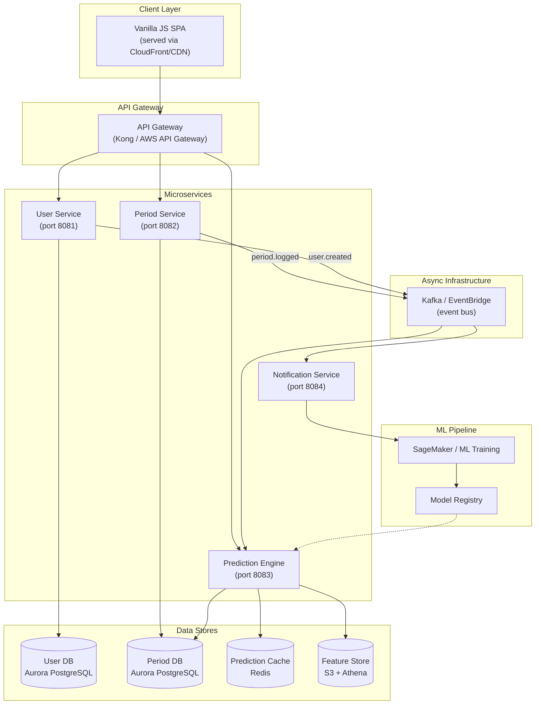
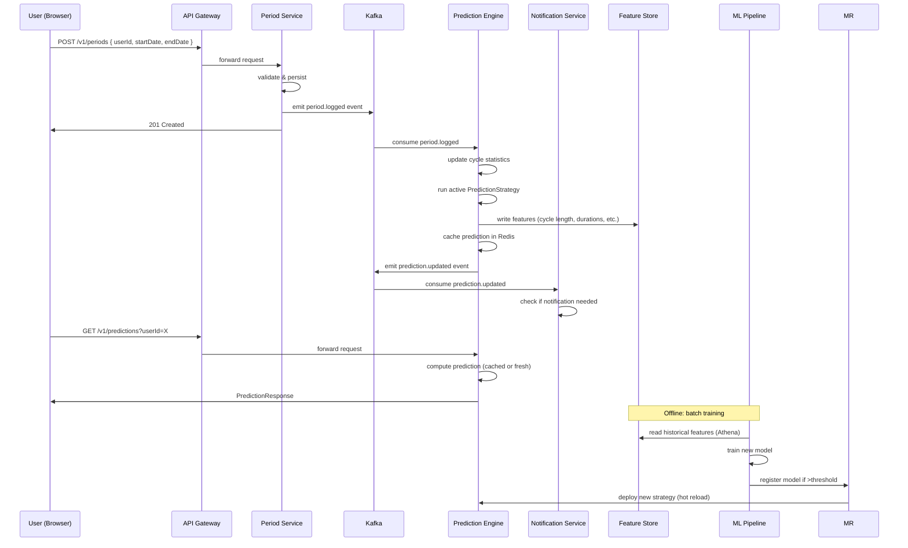
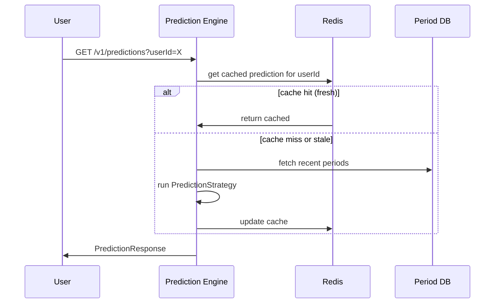
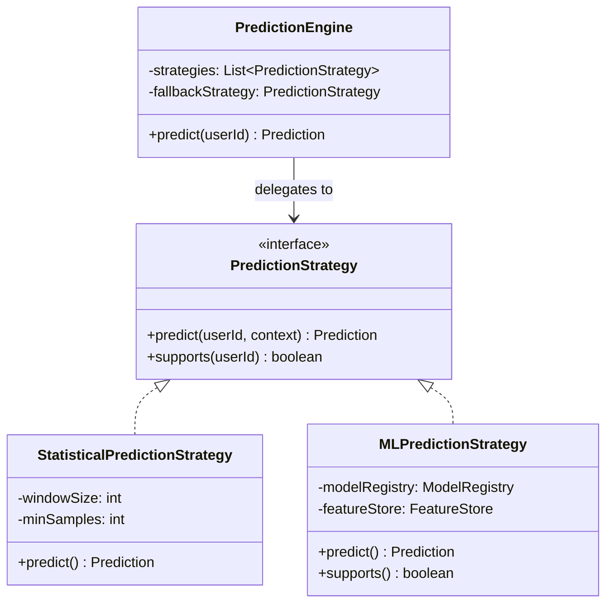
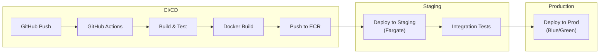

# maas — Production Architecture

## Overview

maas (Menstrual health as a Service) is designed as a **microservice architecture** from day one, with each service owning its own data store and communicating via asynchronous events where possible. The prediction engine uses a **strategy pattern** to allow swapping from a simple statistical baseline to ML-based models without changing the caller.

## Architecture Diagram



## Data Flow Diagram



### Alternative: Read-Through Cache on Read Path

For lower prediction latency, the read path can fetch from the cache (Redis) and only compute fresh if the cache is cold:



## Component Details

### 1. User Service (Port 8081)
- **Responsibilities:** Registration, profile management, authentication (JWT or OAuth2)
- **Database:** Aurora PostgreSQL — `users`, `user_profiles` tables
- **Endpoints:**
  - `GET /v1/users` — list/search users
  - `PUT /v1/profile` — create/update profile
  - `GET /v1/profile` — get profile
- **Events emitted:** `user.created`, `profile.updated`

### 2. Period Service (Port 8082)
- **Responsibilities:** CRUD for period logs, cycle statistics computation, idempotent writes
- **Database:** Aurora PostgreSQL — `period_logs`, `symptom_catalog`, `symptom_entries`, `user_cycle_stats` tables
- (Future: `period_logs` partitioned by time for query performance)
- **Natural key:** `(user_id, start_date)` ensures idempotent period logging
- **Endpoints:**
  - `POST /v1/periods` — log a period (idempotent via unique constraint)
  - `GET /v1/periods` — list periods (paginated)
- **Events emitted:** `period.logged`, `period.updated`, `period.deleted`

### 3. Prediction Engine (Port 8083)
- **Responsibilities:** Cycle prediction, ovulation estimation, fertile window calculation
- **Strategy pattern** for extensible prediction algorithms:
  - `PredictionStrategy` — interface
  - `StatisticalPredictionStrategy` — rolling average + std deviation (current default)
  - `MLPredictionStrategy` — loads model from registry (future)
- **Cache:** Redis — predictions cached per user, invalidated on new period log
- **Feature Store:** S3 + Athena for batch feature extraction (cycle lengths, durations, flow patterns, symptoms)
- **Endpoints:**
  - `GET /v1/predictions` — get prediction for user
  - `GET /v1/predictions/health` — strategy health / fallback status
- **Consumes events:** `period.logged`, `user.created`
- **Emits events:** `prediction.updated`

### 4. Notification Service (Port 8084)
- **Responsibilities:** Send push/email/SMS reminders
- **Database:** Aurora PostgreSQL — `notification_prefs`, `notification_log` tables
- **Consumes events:** `prediction.updated` (triggers upcoming period reminder)
- **Future:** Scheduled checks via cron job for users approaching predicted dates

## Prediction Strategy — Extensibility



The `PredictionEngine` maintains an ordered list of strategies. It tries each strategy's `supports()` method and uses the first that returns true. If all fail, it falls back to the onboarding baseline. This allows:
1. **Progressive enhancement** — users with few logs get statistical predictions; users with rich history get ML predictions
2. **A/B testing** — different strategies can be assigned to different user cohorts
3. **Graceful degradation** — if the ML service is down, falls back to statistics

## Data Model (Per-Service Databases)

**User Service:**
```
users: id, email, display_name, created_at, updated_at
user_profiles: id, user_id (FK), typical_cycle_length_days, typical_period_duration_days,
               last_period_start_date, onboarding_completed, created_at, updated_at
```

**Period Service:**
```
period_logs: id, user_id, start_date, end_date, flow_intensity, notes,
             cycle_length_days, created_at, updated_at
             UNIQUE(user_id, start_date)
symptom_catalog: id, name, category, icon
symptom_entries: id, period_log_id (FK), symptom_id (FK), severity
user_cycle_stats: id, user_id (FK, unique), total_cycles_logged, avg_cycle_length_days,
                  avg_period_duration_days, last_updated
```

## Event Schema

```json
{
  "eventType": "period.logged",
  "version": 1,
  "timestamp": "2026-01-15T10:30:00Z",
  "payload": {
    "userId": 42,
    "periodLogId": 101,
    "startDate": "2026-01-10",
    "endDate": "2026-01-15",
    "cycleLengthDays": 28
  }
}
```

## Infrastructure

| Component | Development | Production |
|-----------|-------------|------------|
| Database | SQLite (file) | Aurora PostgreSQL (Multi-AZ) |
| Cache | None | Redis ElastiCache |
| Event Bus | In-memory | Kafka / MSK |
| Object Storage | Local FS | S3 |
| Auth | None (bypassed) | OAuth2 / JWT |
| Container | Maven exec | Docker → ECS / Fargate |
| API Gateway | Direct | Kong / AWS API Gateway |
| Feature Store | CSV | S3 + Athena |

## Feature Store (ML Readiness)

The feature store captures per-user cycle statistics as features for ML models. Each row represents one cycle:

| Feature | Description | Type |
|---------|-------------|------|
| user_id | User identifier | categorical |
| cycle_number | Sequential cycle index | ordinal |
| cycle_length_days | Days between period starts | continuous |
| period_duration_days | Days of bleeding | continuous |
| avg_flow_intensity | Mean flow rating (1-5) | continuous |
| std_flow_intensity | Flow variability | continuous |
| day_of_week_start | Day period started (0=Sun) | cyclical |
| season | Season of start date | categorical |
| symptoms_present | Comma-separated symptom IDs | multi-label |
| age_group | User age bracket | categorical |
| stress_level | Self-reported (1-5) | ordinal |
| sleep_avg | Average sleep hours | continuous |
| exercise_freq | Days exercised this cycle | count |

These features enable models like:
- **Next period prediction:** Regression on cycle_length_days using LSTM or Prophet
- **Anomaly detection:** Autoencoder flagging unusually long/short cycles
- **Symptom prediction:** Multi-label classification for symptom forecasting

## Security (Minimal Viable)

- Internal service-to-service communication uses a shared API key (env var)
- No TLS between services within the same VPC (AWS private subnets)
- Rate limiting on the API Gateway layer
- CORS allowing known origins only (increased from wildcard for production)
- User IDs as simple longs (real auth would replace this with JWT subject claims)
- No encryption at rest beyond what Aurora provides by default

## Deployment


